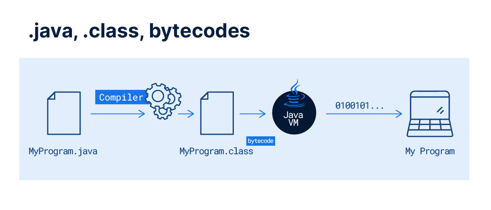

# Java: o que é, linguagem e um Guia para iniciar na tecnologia

Anotações do artigo da Alura que pode ser acessado através [deste link](https://www.alura.com.br/artigos/java)

## Introdução

Java é uma das linguagens mais utilizadas no desenvolvimento de aplicações ao redor do mundo.

Segundo pesquisa do __StackOverflow realizada em 2022__, Java figura como a 6ª linguagem mais utilizada por pessoas desenvolvedoras.

## O que é Java?

Java é uma __plataforma de programação__ que nasceu em 1995, desenvolvida pela empresa _Sun Microsystem_. A plataforma Java entrega um _ambiente completo_ para o desenvolvimento e execução de programas, sendo composta por:

- Uma linguagem de programação de __alto nível orientada a objetos__;
- Uma Máquina Vitrual (Java Virtual Machine ou JVM), que garante __independência de plataformas__ pois o código é executado nesta máquina virtual, podendo ser portada para Windows, Linux e etc
- Java Runtime Environment ou JRE, que agrega alguns recursos à maquina virtual para a execução de aplicações Java;
- Java Development Kit ou JDK, que é um conjunto de utilitários que oferece suporte ao desenvolvimento de aplicações;

No Java os programas são escritos em arquivos _.java_ e depois são compilados para arquivos com extensão _.class_. Esses possuem o código que será executado na máquina virtual, os __bytecodes__.

A JVM está disponível para a __maioria dos sistemas operacionais do mercado__, sendo assim conseguimos rodar a mesma aplicação Java no Windows, macOS, Linux, Solaris, entre outros.

## Tecnologia Java

A plataforma Java é estruturada em um portfólio que idealiza que um mesmo programa possa __funcionar em diferentes sistemas operacionais e dispositivos__. Atualmente a plataforma está dividida em duas grandes áreas:

- Java Standard Edition ou _JavaSE_
- Java Enterprise Edition ou _JavaEE_

### Java Standard Edition ou JavaSE

Componente padrão que fornece um ambiente para __desenvolvimento de aplicações de pequeno e médio porte__, além de um conjunto de APIs base da plataforma e a JVM padrão.

### Java Enterprise Edition ou JavaEE

Componente baseado no JavaSE, é focado no __desenvolvimento de aplicações empresariais multicamadas de grande porte__ e provê serviços adicionais, ferramentas e APIs para simplificar a criação de aplicações complexas.

> Java é lento? [Neste link](https://youtu.be/rrhO_P0IM3s) a Alura esclarece esta possível dúvida

Assistir vídeo acima
