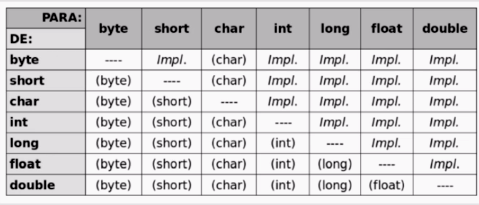

# Java: criando sua primeira aplicação

## Índice

- [Java: criando sua primeira aplicação](#java-criando-sua-primeira-aplicação)
  - [Índice](#índice)
  - [Antes de começar](#antes-de-começar)
  - [Primeiro programa em Java](#primeiro-programa-em-java)
    - [Preparando o ambiente](#preparando-o-ambiente)
    - [O primeiro programa](#o-primeiro-programa)
    - [Desvendando o arquivo .class](#desvendando-o-arquivo-class)
    - [O que aprendemos?](#o-que-aprendemos)
  - [Construindo o catálogo de filmes](#construindo-o-catálogo-de-filmes)
    - [Atribuindo valores ao filme](#atribuindo-valores-ao-filme)
    - [Trabalhando com textos](#trabalhando-com-textos)
    - [**Para saber mais: strings e text blocks**](#para-saber-mais-strings-e-text-blocks)
    - [**Para saber mais: formatação de textos**](#para-saber-mais-formatação-de-textos)
    - [**Convertendo valores**](#convertendo-valores)
    - [**Para saber mais: casting**](#para-saber-mais-casting)
    - [O que aprendemos?](#o-que-aprendemos-1)
  - [Controlando o fluxo da aplicação](#controlando-o-fluxo-da-aplicação)
    - [Tomando decisões condicionais (if)](#tomando-decisões-condicionais-if)
    - [**Para saber mais: Switch Case**](#para-saber-mais-switch-case)
    - [Leitura de dados (scanner)](#leitura-de-dados-scanner)
    - [**Para saber mais: a classe Scanner**](#para-saber-mais-a-classe-scanner)
    - [Avaliando o filme (for)](#avaliando-o-filme-for)
    - [**Outras formas de iterar dados (while)**](#outras-formas-de-iterar-dados-while)
    - [**Faça como eu fiz: jogo de adivinhação**](#faça-como-eu-fiz-jogo-de-adivinhação)
    - [O que aprendemos?](#o-que-aprendemos-2)
  - [Consolidando conhecimentos](#consolidando-conhecimentos)
    - [**Construindo uma nova aplicação**](#construindo-uma-nova-aplicação)
    - [Apresentação do desafio](#apresentação-do-desafio)
    - [O que aprendemos](#o-que-aprendemos-3)

## Antes de começar

- [x]  Criar pasta referente ao curso
- [x]  Adicionar link da pasta nos atributos do curso
- [x]  Adicionar arquivos e links adicionais ao repositório (pdf, pptx, etc)

## Primeiro programa em Java

### Preparando o ambiente

Para preparar o ambiente é necessário baixar o Java através do site da Oracle.

Existe o JRE que é para quem executa a plicação

O JDK é para quem vai desenvolver.

Vamos optar sempre pela versão LTS do JDK para desenvolver com ele, a LTS é a de suporte longo.

Depois de instalar, temos que baixar uma IDE para trabalhar com Java, no caso do curso será usara a IntelliJ na versão Community que é gratuita.

### O primeiro programa

Para criar o primeiro programa precisamos criar um novo projeto dentro do IntelliJ.

Basta configurar o nome do projeto e alguns detalhes.

Depois podemos criar esse código dentro do arquivo `Main` na pasta src

```java
public class Main {
    public static void main(String[] args) {

        System.out.println("Hello World!");
    }
}
```

### Desvendando o arquivo .class

Ao executar o código Java o IntelliJ cria uma pasta com a mesma estrutura de diretórios interna, mas se chama `out`.

Nessa pasta existem os arquivos `.class` que são os arquivos intermediários que são compilados e interpretados pela JVM.

### O que aprendemos?

- A configurar o ambiente de desenvolvimento, instalando a JDK 17 e a IDE IntelliJ;
- As diferenças entre JVM, JRE e JDK:
    - JVM (Java Virtual Machine) - é a Máquina Virtual do Java responsável por executar o bytecode;
    - JRE (Java Runtime Environment) - Ambiente de Execução do Java que fornece as bibliotecas padrões do Java para o JDK compilar o seu código e para a JVM executar o seu programa;
    - JDK (Java Development Kit) - Kit de Desenvolvimento Java responsável por compilar código-fonte em bytecode.
- A fazer o “Alô Mundo!” no Java e executar seu primeiro programa pelo IntelliJ;

## Construindo o catálogo de filmes

### Atribuindo valores ao filme

Ao longo da jornada vamos construir uma aplicação que trabalha com dados de filmes.

O primeiro passo nesse caso é criar variáveis.

Para declarar variáveis em Java é necessário informar o tipo ao criar uma variável.

Em Java temos algumas convenções de nome de classe, o camelCase.

- Com isso, temos o código abaixo

    ```java
    public class Main {
        public static void main(String[] args) {
    
            System.out.println("Hello World!");
    
            int ano = 2022;
            String filme = "Top Gun: Maverick";
            boolean incluidoNoPlano = true;
            double notaFilme = 8.5;
    
            System.out.println("Filme? " + filme);
            System.out.println("Ano de lançamento? " + ano);
            System.out.println("Esse filme está plano? " + incluidoNoPlano);
            System.out.println("Nota do filme? " + notaFilme);
        }
    }
    ```

### Trabalhando com textos

Nas versões mais recentes de Java podemos criar o que são chamados de `text box` para evitar usar vários `System.out.println` em linhas.

- Código de exemplo

    ```java
    String dados = """
                    Filme: Maverick
                    Ano: 2023
                    Catálogo: True
                    Nota: 8.5
                    """;
    
            System.out.println(dados);
    ```

Existem formas mais inteligentes de fazer isso através métodos como o `formatted`.

### **Para saber mais: strings e text blocks**

Em Java, é possível comparar duas Strings utilizando o operador ==. Porém, esse operador verifica apenas se as duas variáveis apontam para o mesmo objeto na memória, e não se o conteúdo das Strings é igual.

Para comparar o conteúdo de duas Strings é necessário utilizar o método `equals()`.

- Exemplo

    ```java
    String senha = "12345";
    if (senha.equals("12345")) {
        System.out.println("Acesso autorizado!");
    }else {
        System.out.println("Senha incorreta.");
    }
    ```

Mais pra frente vamos trabalhar também com o método `equalsIgnoreCase()` que é usado para comparar desconsiderando maiúsculas e minúsculas.

Para criar um **text blocs** basta utilizar **três** aspas duplas para delimitar o texto, seguidas de uma quebra de linha.

- Por exemplo

    ```python
    String mensagem = """
                      Olá, mundo!
                      Este é um Text Block.
                      Ele permite escrever textos com múltiplas linhas
                      sem precisar usar caracteres de escape ou quebras de linha manualmente ou concatenações.
                      """;
    ```

### **Para saber mais: formatação de textos**

Uma das maneiras mais comuns de se formatar textos em Java é utilizando o método `format()`, da classe String.

Esse método permite formatar um texto utilizando diversos placeholders, que são representados pelo caractere `%` seguido de uma letra que indica o tipo de dado que será inserido no placeholder.

Por exemplo, `%s` indica que uma String será inserida no placeholder, `%d` indica um valor inteiro e `%f` indica um valor decimal.

- Abaixo um exemplo

    ```java
    String nome = "Maria";
    int idade = 30;
    double valor = 55.9999;
    System.out.println(String.format("Meu nome é %s, eu tenho %d anos e hoje gastei %.2f reais", nome, idade, valor));
    ```

Esse exemplo também pode ser usado com `Text Block` .

- Exemplo

    ```java
    String nome = “João”;
    int aulas = 4;
    
    String mensagem = """
                      Olá, %s!
                      Boas vindas ao curso de Java.
                      Teremos %d aulas para te mostrar o que é preciso para você dar o seu primeiro mergulho na linguagem!
                      """.formatted(nome, aulas);
    
    System.out.println(mensagem);
    ```

### **Convertendo valores**

Podemos converter variáveis fazendo `casting` delas.

Para isso precisamos passar o tipo antes do valor passado, de forma que forçamos ele a caber em outra variável.

- Exemplo

    ```java
    double nota2Filme = 6.0;
            int classificacao = (int) nota2Filme;
    ```

Existem 2 tipos de casting, o explícito e o implícito. Quando precisamos forçar o casting, esse é do tipo explícito, quando o própio JVM faz, é o implícito.

- Tabela

    

### **Para saber mais: casting**

O casting é utilizado para permitir que tipos de dados incompatíveis possam ser utilizados em uma mesma operação ou expressão.

Por exemplo, se um método espera um parâmetro do tipo int e o valor que se deseja passar é do tipo double, é necessário fazer um casting para converter o valor em int.

- **Casting implícito**

    O casting implícito é realizado automaticamente pelo compilador quando o tipo de dado de origem é compatível com o tipo de dado de destino. Por exemplo, é possível atribuir um valor de tipo int a uma variável do tipo double, pois o tipo double é maior e suporta todos os valores que o tipo int pode armazenar

    - Exemplo

        ```java
        int x = 10;
        double y = x; // casting implícito
        ```

- **Casting explícito**

    O casting explícito é realizado quando o tipo de dado de origem é incompatível com o tipo de dado de destino. Nesse caso, devemos utilizar o operador de casting para realizar a conversão.

    - Exemplo

        ```java
        double x = 10.5;
        int y = (int) x; // casting explícito
        ```

Existe uma tabela para facilitar a identificação de quando é necessário realizar o casting.

- Tabela

    

### O que aprendemos?

- A trabalhar com variáveis: recurso utilizado para armazenar valores em memória;
- Sobre tipos primitivos:
    - inteiros (byte, short, int, long);
    - ponto flutuante (double e float);
    - char: contém um único caractere;
    - boolean: recebe 2 valores, true e false;
- Como representar textos em Java, utilizando a classe String;
- A realizar **casting** de valores, para resolver situações de tipos incompatíveis no momento de realizar um cálculo ou atribuição de uma variável.

## Controlando o fluxo da aplicação

### Tomando decisões condicionais (if)

Começamos criando uma nova classe para trabalhar com condicionais.

- Código criado em aula

    ```java
    public class Condicional {
        public static void main(String[] args){
            int anoDeLancamento = 2023;
            boolean incluidoNoPlano = false;
            double notaFilme = 8.5;
            String tipoDoPlano = "plus";
    
            // If
            if (anoDeLancamento > 2022){
                System.out.println("Lançamentos: ");
            }else {
                System.out.println("Filme retrô:");
            }
    
            if (incluidoNoPlano || tipoDoPlano.equals("plus")){
                System.out.println("Filme liberado");
            }else {
                System.out.println("Contratar plano");
            }
    
        }
    }
    ```

### **Para saber mais: Switch Case**

Uma alternativa ao if/else é o **switch case**, que é uma estrutura de controle de fluxo que permite executar diferentes ações com base no valor de uma expressão. É uma forma mais simplificada e legível de escrever vários blocos if/else encadeados.

- Sintaxe de exemplo

    ```java
    switch (expressão) {
       case valor1:
          // código a ser executado se a expressão for igual a valor1
          break;
       case valor2:
          // código a ser executado se a expressão for igual a valor2
          break;
       case valor3:
          // código a ser executado se a expressão for igual a valor3
          break;
       ...
       default:
          // código a ser executado se a expressão não for igual a nenhum valor
          break;
    }
    ```

### Leitura de dados (scanner)

Vamos criar uma nova classe para simular a entrada de dados via terminal.

Para esse tipo de interação precisamos importar a classe Scanner do Java na forma de criação de um objeto.

- Exemplo

    ```java
    import java.util.Scanner;
    
    public class Leitura {
        public static void main(String[] args) {
            Scanner leitura = new Scanner();
        }
    }
    ```

Depois armazenamos um dado do console em uma variável:

- Exemplo

    ```java
    import java.util.Scanner;
    
    public class Leitura {
        public static void main(String[] args) {
            // Criando scanner
            Scanner leitura = new Scanner(System.in);
    
            System.out.println("Digite seu filme favorito: ");
            // Armazenando leitura do terminal em variável
            String filme = leitura.nextLine();
        }
    }
    ```

Depois armazenamos os demais dados e imprimimos uma resposta:

- Exemplo

    ```java
    import java.util.Scanner;
    
    public class Leitura {
        public static void main(String[] args) {
            // Criando scanner
            Scanner leitura = new Scanner(System.in);
    
            System.out.println("Digite seu filme favorito: ");
            // Armazenando leitura do terminal em variável
            String filme = leitura.nextLine();
    
            System.out.println("Agora digite o ano de lançamento: ");
            // Armazenando um int
            int anoDeLancamento = leitura.nextInt();
    
            // Armazenando double
            System.out.println("Digite sua nota: ");
            double nota = leitura.nextDouble();
    
            System.out.println("Filme: " + filme + " Ano: " + anoDeLancamento + " Nota: " + nota);
        }
    
    }
    ```

Repare que o Scanner possui um `nextLine` para cada tipo de variável primitiva.

### **Para saber mais: a classe Scanner**

A classe Scanner do Java é utilizada para ler dados de entrada em um programa Java. Esses dados podem ser lidos a partir de várias fontes de entrada, como arquivos, fluxos de entrada, Strings e até mesmo a entrada do usuário através do teclado, como vimos em aula.

Ela oferece uma série de métodos para ler dados de diferentes tipos, como inteiros, números de ponto flutuante, strings e caracteres.

Para utilizar a classe Scanner, primeiro é necessário importá-la no início do seu programa. Provavelmente ao incluir a mesma no código, a IDE já vai sugerir o import. Esse import ficará como descrito abaixo:

**`import** java.util.Scanner;`

Você pode encontrar a lista completa de métodos na [documentação oficial do Java](https://docs.oracle.com/en/java/javase/17/docs/api/java.base/java/util/Scanner.html).

### Avaliando o filme (for)

Vamos criar um loop para pegar 3 notas de filme e depois fazer uma média.

- Exemplo

    ```java
    import java.util.Scanner;
    
    public class Loop {
    
        public static void main(String[] args) {
    
            // Criando scanner
            Scanner leitura = new Scanner(System.in);
            double nota = 0;
            double mediaDasNotas =0;
    
            // Criando for
            for (int i = 0; i < 3; i++) {
                // Armazenando nota
                System.out.println("Digite uma nota: ");
                nota = leitura.nextDouble();
                mediaDasNotas += nota;
            }
    
            System.out.println("Média das notas: " + mediaDasNotas / 3);
    
        }
    }
    ```

### **Outras formas de iterar dados (while)**

Existe uma outra forma de iterar dados de forma que a gente dê uma condição de parada.

Podemos usar o while neste caso.

- Exemplo

    ```java
    import java.util.Scanner;
    
    public class OutroLoop {
    
        public static void main(String[] args) {
            // Criando scanner
            Scanner leitura = new Scanner(System.in);
            double nota = 0;
            double mediaDasNotas = 0;
            int totalDeNotas = 0;
    
            while(nota != -1){
                // Armazenando nota
                System.out.println("Digite uma nota ou -1 para encerrar: ");
                nota = leitura.nextDouble();
    
                if (nota != -1){
                    mediaDasNotas += nota;
                    totalDeNotas++;
                }
    
            }
            System.out.println("Média das notas: " + mediaDasNotas / totalDeNotas);
    
        }
    }
    ```

### **Faça como eu fiz: jogo de adivinhação**

Crie um programa que simula um jogo de adivinhação, que deve gerar um número aleatório entre 0 e 100 e pedir para que o usuário tente adivinhar o número, em até 5 tentativas. A cada tentativa, o programa deve informar se o número digitado pelo usuário é maior ou menor do que o número gerado.

- **Dicas**
    - Para gerar um número aleatório em Java: `new Random().nextInt(100)`;
    - Utilize o Scanner para obter os dados do usuário;
    - Utilize uma variável para contar as tentativas;
    - Utilize um loop para controlar as tentativas;
    - Utilize a instrução `break;` para interromper o loop.

- **Minha resposta**

    ```java
    import java.util.Random;
    import java.util.Scanner;
    
    public class JogoAdivinhacao {
    
        public static void main(String[] args) {
            Scanner leitura = new Scanner(System.in);
            int numeroDaSorte = new Random().nextInt(100);
            int tentativas = 5;
            int chute = 0;
    
            while (tentativas != 0){
                System.out.println("Digite um número: ");
                chute = leitura.nextInt();
    
                if (chute > numeroDaSorte) {
                    System.out.println("O número chutado foi MAIOR do que o número da sorte.");
                } else if (chute < numeroDaSorte) {
                    System.out.println("O número chutado foi MENOR do que o número da sorte.");
                } else {
                    System.out.println("Você acertou o número chutado com " + tentativas + " tentativas restantes!!");
                    break;
                }
    
                tentativas--;
    
                if (tentativas == 0) {
                    System.out.println("Você desperdiçou suas chances. O número sorteado era " + numeroDaSorte);
                } else {
                    System.out.println("Restam " + tentativas + " tentativas.");
                }
    
            }
        }
    }
    ```

### O que aprendemos?

- A configurar uma aplicação para que ela escolha entre executar uma ação ou outra baseada em algum elemento;
- Comparações para as condicionais: igual, diferente, maior, menor;
- A usar a leitura do teclado com a classe `Scanner`;
- Trabalhar com alternativas para as condicionais e escolher a ideal para o caso escolhido;
- A utilizar estruturas de repetição com `for` e `while`.

## Consolidando conhecimentos

### **Construindo uma nova aplicação**

Nesta aula, eu gostaria de propor um novo desafio para que você possa consolidar os seus conhecimentos e utilizar grande parte dos conceitos e recursos vistos ao longo do curso. A linguagem de programação Java é muito poderosa e versátil e é usada em muitas aplicações do mundo real, desde jogos até aplicativos empresariais.

A proposta é criarmos uma nova aplicação, diferente do `ScreenMatch`, para que você tenha a oportunidade de praticar e aprofundar sua compreensão dos conceitos fundamentais do Java.

No primeiro vídeo, eu apresentarei o desafio proposto, detalhando e sugerindo a implementação dessa nova aplicação. Nos vídeos subsequentes, irei resolvendo aos poucos para que, caso você tenha alguma dúvida ao longo do processo, possa ir fazendo passo a passo e tentando concluir o desafio sozinho.

### Apresentação do desafio

Durante as próximas aulas a instrutora vai apresentar um desafio de projetinho e ajudar a solucionar ele.

A sugestão é que tentemos fazer ele sozinho.

- Template esperado

    ```markdown
    ***********************
    Dados iniciais do cliente:
    
    Nome: Jacqueline Oliveira
    Tipo conta: Corrente
    Saldo inicial: R$ 2500,00
    ***********************
    
    Operações
    
    1- Consultar saldos
    2- Receber valor
    3- Transferir valor
    4- Sair
    
    Digite a opção desejada:
    ```

- Minha resposta

    ```java
    import java.util.Scanner;
    
    public class Banco {
        public static void main(String[] args) {
            // Declarando variáveis globais
            Scanner leitura = new Scanner(System.in);
            String nome = "";
            String tipoDeConta = "";
            double saldo = 0;
            int opcao = 0;
    
            // Recebendo e imprimindo informações iniciais do cliente
            System.out.println("Digite seu nome: ");
            nome = leitura.nextLine();
    
            System.out.println("Digite o tipo de conta: ");
            tipoDeConta =  leitura.nextLine();
    
            System.out.println("Digite o saldo inicial: ");
            saldo = leitura.nextDouble();
    
            // Imprimindo dados iniciais do cliente
            System.out.println("---------------------------");
            System.out.println("***********************");
            System.out.println("Dados iniciais do cliente:");
            System.out.println("Nome: " + nome);
            System.out.println("Tipo de conta: " + tipoDeConta);
            System.out.println("Saldo inicial: " + saldo);
            System.out.println("***********************");
    
            System.out.println();
            while(opcao != 5){
                System.out.println("Operações disponíveis");
                System.out.println("1 - Consultar saldo");
                System.out.println("2 - Receber valor");
                System.out.println("3 - Transferir valor");
                System.out.println("4 - Sair");
                System.out.println();
    
                double valorTransferido = 0;
    
                System.out.println("Digite a opção desejada");
                opcao = leitura.nextInt();
    
                switch (opcao){
                    case 1:
                        System.out.println("O saldo atual é: " + saldo);
                        System.out.println();
                        break;
                    case 2:
                        System.out.println("Digite o valor a ser recebido: ");
                        valorTransferido = leitura.nextDouble();
                        saldo += valorTransferido;
                        System.out.println("O saldo atual é: " + saldo);
                        System.out.println();
                        break;
                    case 3:
                        System.out.println("Digite o valor a ser transferido: ");
                        valorTransferido = leitura.nextDouble();
                        if (valorTransferido > saldo){
                            System.out.println("Não consigo fazer esta operação.");
                        }else {
                            saldo -= valorTransferido;
                        }
                        System.out.println("O saldo atual é: " + saldo);
                        System.out.println();
                        break;
                    case 4:
                        System.out.println();
                        System.out.println("Saindo do sistema");
                        opcao = 5;
                        System.out.println();
                        break;
                    default:
                        System.out.println();
                        System.out.println("Opção inválida. Digite novamente.");
                        System.out.println();
    
                }
    
            }
    
        }
    }
    ```

- Resposta do professor

    ```java
    import java.util.Scanner;
    
    public class Desafio {
        public static void main(String[] args) {
            String nome = "Clark Kent";
            String tipoConta = "Corrente";
            double saldo = 1599.99;
            int opcao = 0;
    
            System.out.println("***********************");
            System.out.println("\nNome do cliente: " + nome);
            System.out.println("Tipo conta: " + tipoConta);
            System.out.println("Saldo atual: " + saldo);
            System.out.println("\n***********************");
    
            String menu = """
                    ** Digite sua opção **
                    1 - Consultar saldo
                    2 - Transferir valor
                    3 - Receber valor 
                    4 - Sair
                    
                    """;
            Scanner leitura = new Scanner(System.in);
    
            while (opcao != 4) {
                System.out.println(menu);
                opcao = leitura.nextInt();
    
                if (opcao == 1){
                    System.out.println("O saldo atualizado é " + saldo);
                } else if (opcao == 2) {
                    System.out.println("Qual o valor que deseja transferir?");
                    double valor = leitura.nextDouble();
                    if (valor > saldo) {
                        System.out.println("Não há saldo para realizar a transferência.");
                    } else {
                        saldo -= valor;
                        System.out.println("Novo saldo: " + saldo);
                    }
                } else if (opcao == 3) {
                    System.out.println("Valor recebido: ");
                    double valor = leitura.nextDouble();
                    saldo += valor;
                    System.out.println("Novo saldo: " + saldo);
                } else if (opcao != 4) {
                    System.out.println("Opção inválida!");
                }
            }
        }
    }
    ```

### O que aprendemos

• A aplicar seus conhecimentos em uma aplicação de um sistema bancário, utilizando conceitos de variáveis, condicionais, loops e leitura de dados no Java, juntamente à lógica de programação.
